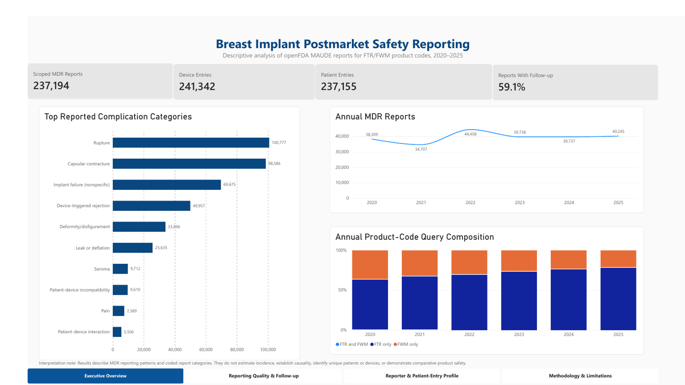
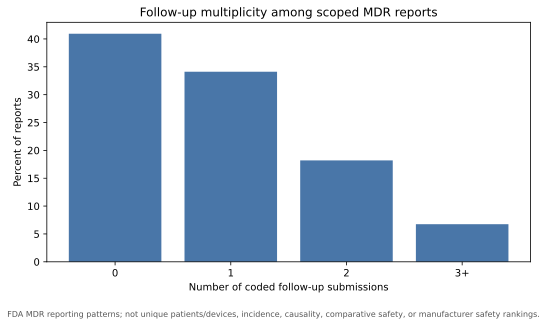
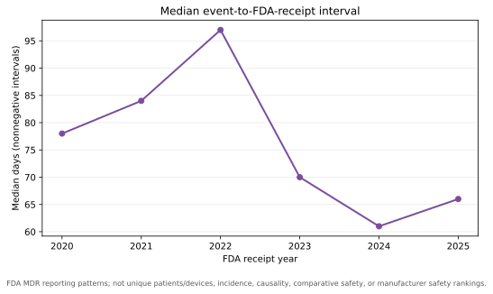

# Breast Implant Postmarket Safety Analysis

   

**A reproducible descriptive analysis of FDA Medical Device Reports for permanent breast implants, 2020–2025**

[Dashboard](#power-bi-dashboard) · [Key findings](#key-findings) · [Methods](#reproduce-the-analysis) · [Interpretation boundaries](#interpretation-boundaries) · [Portfolio claims](docs/PORTFOLIO_CLAIMS.md)

## Project overview

This independent clinical-data portfolio project analyzes FDA MAUDE/openFDA medical
device reports returned by the permanent breast implant product-code queries FTR and
FWM. It demonstrates API extraction, checkpointed pagination, relational data
modeling, data-quality assessment, clinical taxonomy development, pandas analysis,
automated testing, Power BI reporting, and responsible interpretation of postmarket
surveillance data.

The analysis covers aesthetic augmentation and reconstructive relevance. It describes
reported patterns; it does not measure complication incidence or comparative safety.

## Headline results

| Metric | Result |
| --- | ---: |
| API records returned by the two frozen queries | 237,213 |
| Unique MDR reports after cross-query deduplication | 237,194 |
| Device entries | 241,342 |
| Patient entries (not unique patients) | 237,155 |
| Report-label links | 544,199 |
| Exact taxonomy coverage | 98.79% |
| Reports with at least one coded follow-up | 140,095 (59.06%) |
| Reports lacking a usable clinical event date | 52,411 |
| Negative event-to-receipt intervals retained as anomalies | 149 |
| Automated tests at final analytical verification | 59 passing |

The most frequently mapped reported categories were rupture (100,777 reports;
42.49%), capsular contracture (98,586; 41.56%), nonspecific implant failure
(69,675; 29.37%), device-triggered rejection (49,957; 21.06%), and
deformity/disfigurement (33,896; 14.29%). Categories overlap within reports.

## Power BI dashboard

The completed four-page Power BI dashboard presents cohort KPIs, reporting quality and
follow-up, reporter and patient-entry characteristics, and the analytical methodology
and limitations.

- [Dashboard documentation](dashboard/README.md)
- [Technical QA record](dashboard/TECHNICAL_QA.md)
- [Power BI Desktop file](dashboard/Breast_Implant_Postmarket_Safety.pbix)
- [Four-page PDF export](dashboard/Breast_Implant_Postmarket_Safety.pdf)

## Selected figures

Each figure carries the inference warning in the image. These plots describe reporting
processes, not clinical complication rates.

## What this project demonstrates

- Reproducible openFDA extraction with stable sorting, search-after pagination,
  retries, atomic checkpoints, per-page SHA-256 hashes, and resume protection.
- Normalization of nested report, device, and patient arrays into linked tables with
  primary/foreign-key and reconciliation checks.
- Transparent handling of missing, invalid, differently encoded, and repeated values.
- A reviewed complication taxonomy covering all high- and medium-priority labels and
  98.79% of observed report-label links.
- Report-level pandas analysis with preserved entity granularity.
- Data-derived tables, SVG figures, QC manifests, a final evidence report, and a
  publication-ready Power BI dashboard.
- Explicit separation of observed report counts from causal or risk claims.

## Key findings

- Annual report volume ranged from 34,707 to 44,458 between 2020 and 2025, with the
  largest year-over-year increase in 2022 (+28.10%).
- Rupture and capsular contracture were the two most frequently mapped categories.
- 59.06% of reports included at least one coded follow-up submission.
- Clinical event dates were missing for 52,411 reports, limiting event-time analyses.
- Time trends are treated as surveillance/reporting patterns, not clinical incidence.

See the [final evidence summary](reports/final_evidence/FINAL_EVIDENCE_SUMMARY.md) and
[final QC manifest](reports/final_evidence/final_evidence_qc.json).

## Interpretation boundaries

MAUDE is a passive surveillance system. It does not provide the number of implanted
patients or devices, complete case capture, or a validated probability of reporting.
Reports may be affected by follow-up practices, manufacturers, reporters, coding
changes, publicity, litigation, and regulation.

Therefore this project does **not** estimate incidence, prevalence, patient-level
complication percentages, causality, comparative manufacturer/brand safety, or unique
patient counts. Manufacturer and brand counts are reporting associations, not rankings.

## Reproduce the analysis

Python 3.10 or newer is recommended.

~~~powershell
python -m pip install -r requirements.txt
python -m unittest discover -s tests -t . -v

python -m src.normalize_full
python -m src.profile_full
python -m src.build_analytic_dataset
python -m src.analyze_reporting_patterns
python -m src.summarize_cohort_characteristics
python -m src.build_final_evidence
python -m src.build_powerbi_dataset
~~~

Full extraction is checkpointed and resumable; consult the stage documentation before
rerunning downloads. Raw responses and row-level datasets stay local and excluded from
Git. Only aggregate, non-identifiable portfolio outputs are published.

## Repository guide

- [Power BI dashboard](dashboard/README.md) — interactive report, previews, and QA.
- [Protocol v1.0](protocol/PROTOCOL_v1.0.md) — frozen final analytical protocol.
- [Scope v1.0](docs/SCOPE.md) — cohort, questions, exclusions, and deferred extensions.
- [MAUDE orientation](docs/ORIENTATION.md) — valid and invalid inference rules.
- [API field mapping](docs/API_FIELD_MAPPING.md) — source-to-analysis definitions.
- [Taxonomy v5](config/complication_taxonomy_v5.csv) — reviewed clinical mapping.
- [Data handling](data/README.md) — privacy, provenance, and publication rules.
- [Portfolio claims](docs/PORTFOLIO_CLAIMS.md) — verified CV/LinkedIn language.
- `src/full_extractor.py` — resumable full-cohort extraction.
- `src/normalize_full.py` — relational normalization and QC.
- `src/build_analytic_dataset.py` — report-level pandas analytical layer.
- `src/analyze_reporting_patterns.py` — descriptive tables and figures.
- `src/summarize_cohort_characteristics.py` — cohort and data-quality summaries.
- `src/build_final_evidence.py` — QC-gated final evidence package.
- `docs/STAGE_*.md` — chronological development and reproducibility record.

## Data sources

- [FDA MAUDE overview and limitations](https://www.fda.gov/medical-devices/mandatory-reporting-requirements-manufacturers-importers-and-device-user-facilities/about-manufacturer-and-user-facility-device-experience-maude-database)
- [openFDA Device Event API](https://open.fda.gov/apis/device/event/)
- [Device Event searchable fields](https://open.fda.gov/apis/device/event/searchable-fields/)
- [FDA Product Classification Database](https://www.accessdata.fda.gov/scripts/cdrh/cfdocs/cfPCD/classification.cfm)

## Project status

The extraction, normalization, taxonomy, descriptive analysis, QC, automated testing,
static evidence package, and four-page Power BI dashboard are complete. The dashboard
includes a hidden validation page, portfolio previews, a PDF export, and a documented
technical-QA record.

Repository-authored code and documentation are available under the MIT License.
