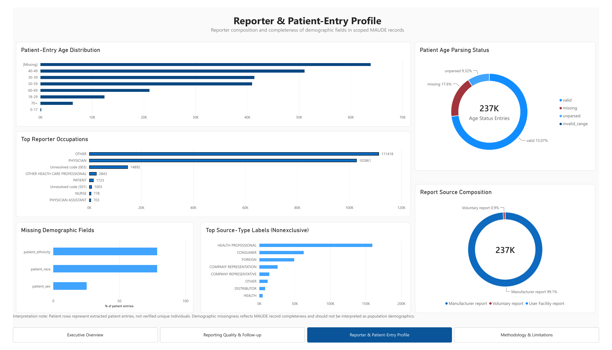
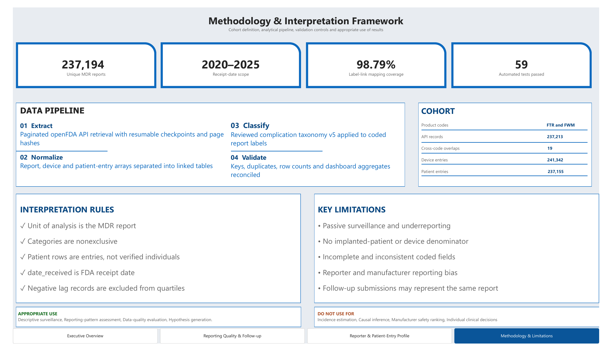

# Power BI dashboard

This dashboard presents aggregate FDA MAUDE/openFDA reporting patterns for the
frozen FTR/FWM breast-implant cohort received during 2020–2025. It is a descriptive
surveillance product and must not be interpreted as incidence, causal risk, or a
comparison of device or manufacturer safety.

## Dashboard pages

1. **Executive Overview** — cohort KPIs, annual MDR volume, leading mapped
   complication categories, and product-code query composition.
2. **Reporting Quality & Follow-up** — reporting-lag quartiles, follow-up submission
   multiplicity, event-date completeness, and negative-lag QA.
3. **Reporter & Patient-Entry Profile** — patient-entry age parsing, reporter
   occupations, source types, source composition, and demographic-field completeness.
4. **Methodology & Limitations** — cohort definition, analytical pipeline,
   validation controls, interpretation rules, and prohibited uses.

The PBIX also contains a hidden **QA – Validation** page used to reconcile dashboard
metrics with the validated aggregate exports.

## Files

- `Breast_Implant_Postmarket_Safety.pbix` — final interactive Power BI Desktop report.
- `Breast_Implant_Postmarket_Safety.pdf` — four-page static export.
- `previews/` — portfolio-friendly page images.
- `TECHNICAL_QA.md` — publication QA record and verified headline metrics.
- `data/` — validated aggregate inputs generated by `src.build_powerbi_dataset`.

## Preview






## Rebuild the aggregate inputs

From the repository root:

```powershell
.\.venv\Scripts\python.exe -m unittest discover -s tests -t . -v
.\.venv\Scripts\python.exe -m src.build_powerbi_dataset
Get-Content .\dashboard\data\PowerBI_QC.json
```

Only aggregate, non-identifiable outputs are published. Report-level records,
narratives, and API responses remain excluded from Git.

