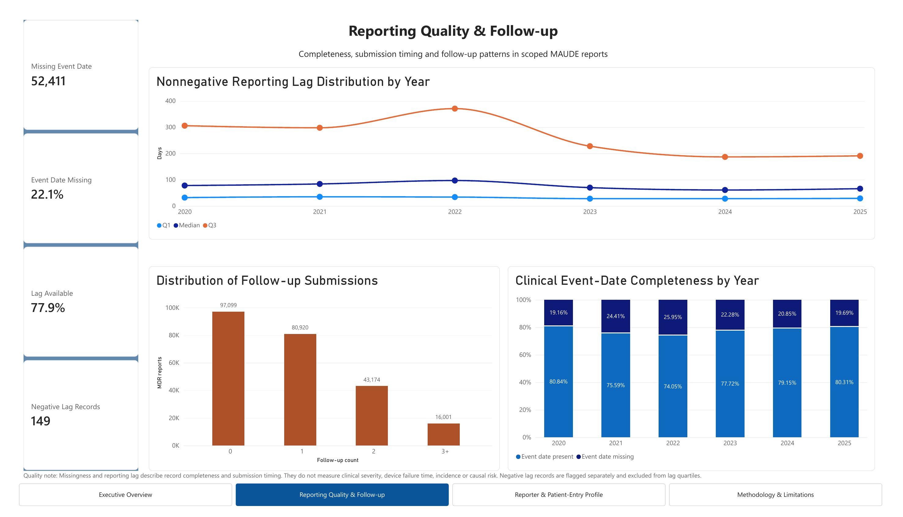

# Power BI dashboard

## Purpose

This four-page dashboard presents aggregate FDA MAUDE/openFDA reporting patterns for
the frozen FTR/FWM breast-implant cohort received during 2020–2025. It is a
descriptive surveillance product and must not be interpreted as incidence, causal
risk, or comparative device or manufacturer safety.

## Dashboard pages

1. **Executive Overview** — cohort KPIs, annual MDR volume, leading mapped
   complication categories, and product-code query composition.
2. **Reporting Quality & Follow-up** — reporting-lag quartiles, follow-up submission
   multiplicity, event-date completeness, and negative-lag QA.
3. **Reporter & Patient-Entry Profile** — patient-entry age parsing, reporter
   occupations, source types, source composition, and demographic-field completeness.
4. **Methodology & Limitations** — cohort definition, analytical pipeline,
   validation controls, interpretation rules, and prohibited uses.

The PBIX also contains a hidden **QA – Validation** page that reconciles dashboard
metrics with the validated aggregate exports.

## Files

- [Power BI Desktop report](Breast_Implant_Postmarket_Safety.pbix)
- [Four-page PDF export](Breast_Implant_Postmarket_Safety.pdf)
- [Technical QA record](TECHNICAL_QA.md)
- [Validated aggregate inputs](data/)
- [Portfolio previews](previews/)

## Preview

## Rebuild the aggregate inputs

From the repository root:

~~~powershell
.\.venv\Scripts\python.exe -m unittest discover -s tests -t . -v
.\.venv\Scripts\python.exe -m src.build_powerbi_dataset
Get-Content .\dashboard\data\PowerBI_QC.json
~~~

The builder refuses to export when an upstream QC gate or reconciliation check fails.
Only aggregate, non-identifiable outputs are published. Report-level records,
narratives, API keys, and raw responses remain excluded from Git.

## Data model

`DimYear[Year]` filters the annual aggregate tables through single-direction,
one-to-many relationships. Whole-cohort and presentation-only aggregate tables remain
disconnected to prevent multiplication of values. Percentage measures are calculated
from counts rather than summed from precomputed percentage columns.

## Interpretation standard

Every page includes an inference warning. Categories and source-type labels are
nonexclusive where stated. Patient rows are extracted entries, not verified unique
individuals. The dashboard must not be used to estimate incidence, causality,
comparative safety, or the number of implanted patients or devices.
